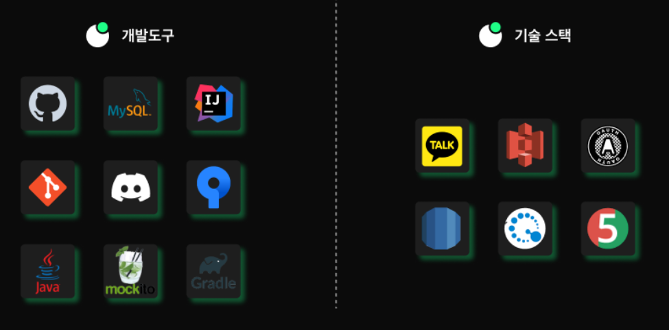

<!DOCTYPE html>
<html>
<head>
    <link rel="stylesheet" type="text/css" href="src/main/resources/static/css/docs.css">
</head>
<body>

<h1 style="color: #FF8C00;">&#127947; HELL-LOW &#127947;</h1>

  <h2 class="section-title">&#128104; 팀 구성</h2>
  <table class="team-table">
    <tr>
      <th>이름</th>
      <th>GitHub</th>
    </tr>
    <tr>
      <td>최재원 (팀장)</td>
      <td><a href="https://github.com/bbabbungtting" class="member-github">GitHub</a></td>
    </tr>
    <tr>
      <td>권광재 (팀원)</td>
      <td><a href="https://github.com/kwongwangjae" class="member-github">GitHub</a></td>
    </tr>
    <tr>
      <td>김민규 (팀원)</td>
      <td><a href="https://github.com/kimmingyu74" class="member-github">GitHub</a></td>
    </tr>
    <tr>
      <td>임성현 (팀원)</td>
      <td><a href="https://github.com/shlim0287" class="member-github">GitHub</a></td>
    </tr>
  </table>

  <h2 class="section-title">📜 프로젝트 개요</h2>
    

        프로젝트 기간  03/25 ~ 04/08  
    

    

    HELL-LOW 는(Helping Everyone Live Longer & Lifestyle Online Wellness) 의 약자로 건강한 휘트니스 문화를 선도하기 위한 온라인 커뮤니티 사이트 입니다. HELL-LOW의 핵심 목적은 사용자 간 정보 공유를 통한 건강한 생활 습관을 장려입니다.
    

  <h2 class="section-title">💻 사용한 기술 스택</h2>
  

  <h2 class="section-title">🏗️ 프로젝트 아키텍처</h2>
  

  <h2 class="section-title">🌲 브랜치 전략</h2>
  
  

    <ul>
      <li>main : 배포 시 사용.</li>
      <li>develop : 완전히 개발이 끝난 부분에 대해서 Merge를 진행.</li>
      <li>feature : 기능 개발을 진행할 때 사용.</li>
    </ul>
  

  <h2 class="section-title">🖼️ 화면 구성도</h2>
  <a href="https://www.figma.com/file/vP3BiserxBBpIFT6WSNpRt/Hell-Low?type=design&node-id=0-1&mode=design&t=sykzizLaSKqpm4VH-0" class="link-placeholder">화면 구성도 상세 보기</a>
  

  <h2 class="section-title">📊 ERD 구조</h2>
  <a href="https://www.erdcloud.com/d/eqGbZDcwbMGdatRMp" class="link-placeholder">ERD 상세 보기</a>
    

  <h2 class="section-title">📄 API 명세서</h2>
  <a href="https://www.notion.so/oreumi/API-5009803210a8464081d36c84d9c7ec9a" class="link-placeholder">API 명세서 상세 보기</a>

  <h2 class="section-title">📝 PR (Pull Request) 규칙</h2>
  <ul class="section-content">
    <li>feature/이슈내용_작성자명 의 브랜치명으로 생성 후 작업한 다음 PR을 날립니다.</li>
    <li>리뷰 후 리팩토링이 필요하다면 추가로 feature/리팩토링 내용_작성자명 진행합니다.</li>
    <li>모든 PR은 반드시 지정한 리뷰어에게 코드리뷰를 받아야만 합니다.</li>
    <li>리뷰어 중 1명 이상의 Approve 를 받아야 Merge pull request 를 할 수 있습니다.</li>
  </ul>

  <h2 class="section-title">🚀  배포 주소</h2>
  <a href="http://3.39.8.24:8080/postList" class="member-github">HELL-LOW</a>

</body>
</html>
